# AgroConnect Market - No-Code E-Commerce Application Design Project

## 👤 Student Information
* **Student Name:** MURIYESU Emma Frieda
* **Registration Number:** 26172/2024
* **Course:** E-Commerce And Web Application Course (EWA408510)
* **Academic Year:** 2025-2026 | Semester: II
* **Lecturer:** Eric Maniraguha
* **Institution:** University of Lay Adventists of Kigali (UNILAK)
* **Group Group:** Weekend Nyanza

---

## 🌾 Project Title
**AgroConnect Market**

---

## 💻 Platform Used
**Wix** (Low-Code/No-Code Website Builder)

---

## 🚀 Features Implemented
1. **Homepage:**
   - **Branding:** Custom logo and brand name ("AgriConnect Market").
   - **Welcome Message:** Clear introduction to the mission of connecting Rwandan farms to customers.
   - **User Guide:** A 3-step visual instruction process explaining "How to Shop Fresh" (Browse Seasonal Crops, Secure Mobile Payment, Fast Home Delivery).
2. **Product Page (Shop):**
   - **Product Catalog:** A catalog of fresh, organic products is listed with rich imagery, prices in Rwandan Francs (RWF/RF), and descriptions.
   - **Interactive Modal Detail:** Users can click on a product (e.g., *Farm Fresh Milk*) to view details, select attributes (Size, Fat Content), adjust quantities, and click "Add to Cart".
3. **About Page:**
   - **Store Description:** Documents the online marketplace mission of empowering local farmers.
   - **Our Story:** Chronicles the startup's mission to bridge the gap between farmers and end consumers.
   - **Impact Metrics:** Highlights achievements such as 5,000+ Happy Farmers, 5,000+ Quality Products, and a 100% Customer Satisfaction rate.
4. **Contact Page:**
   - **Interactive Contact Form:** A clean form enabling users to send messages directly to the support team.
   - **Direct Contact Info:** Active phone number (`+250 791455551`), email address (`agriconnectmarket@gmail.com`), and physical address (`KG 123 St, Nyamagabe District, Kigali, Rwanda`).
5. **Cart Interaction & Flow:**
   - **Slide-out Side Cart:** Automatically displays items currently in the cart with options to adjust quantities.
   - **My Cart Page:** A dedicated cart screen showing an order summary, subtotal calculation, and checkout options.
   - **Simulation Checkout:** Simulated checkout page detailing order summaries and highlighting low-code free-tier checkout limitations.

---

## 🖼️ Screenshots

### 1. Homepage
*Brand identity, hero banner, and the 3-step onboarding guide.*
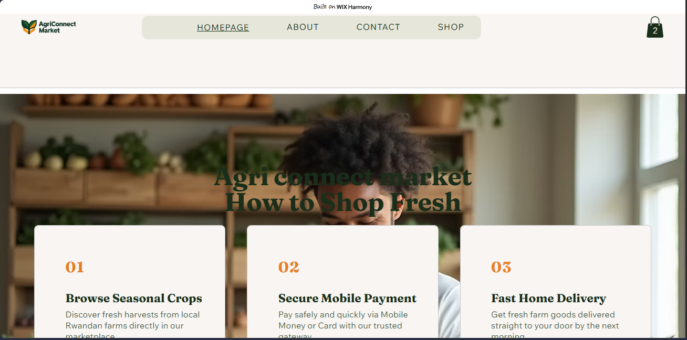
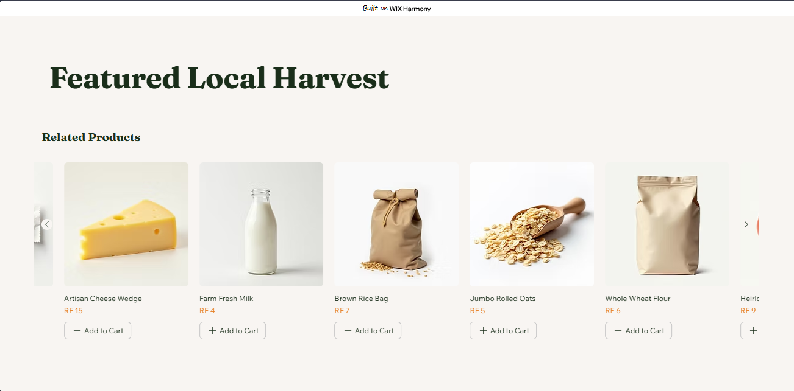

### 2. Product Page (Shop)
*Catalog of fresh organic agricultural products and interactive product detail overlays.*
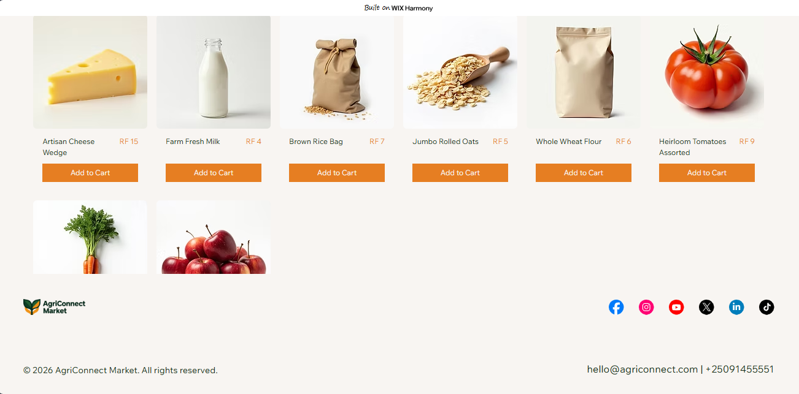
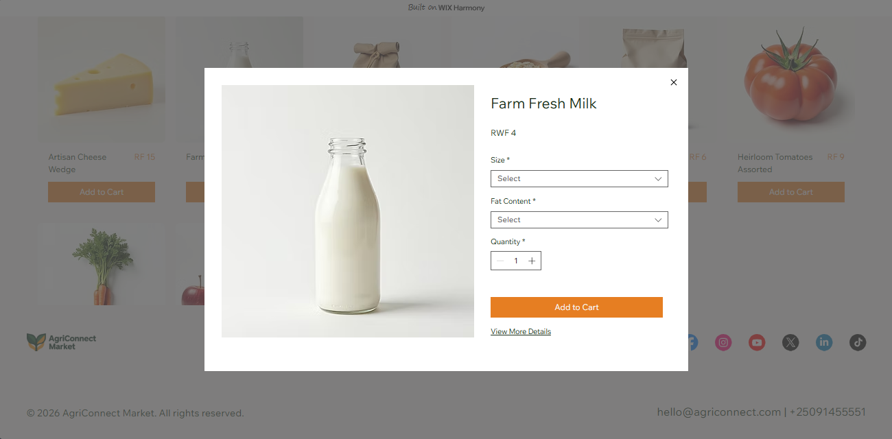

### 3. About Page
*Mission, business model, and agricultural impact metrics across Rwanda.*
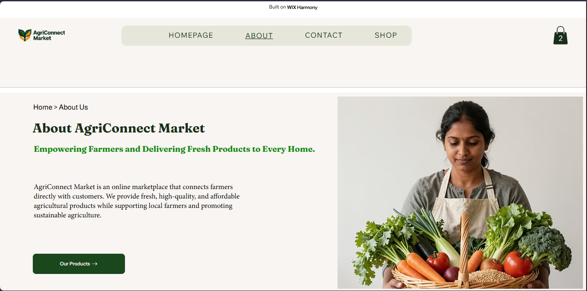
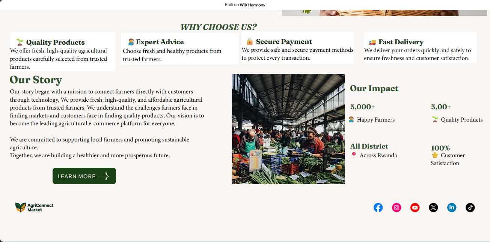

### 4. Contact Page
*Inquiry submission form and local contact details.*
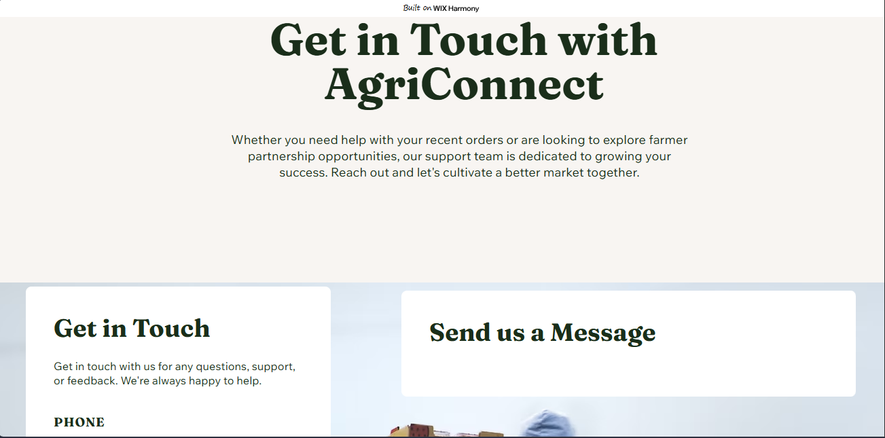
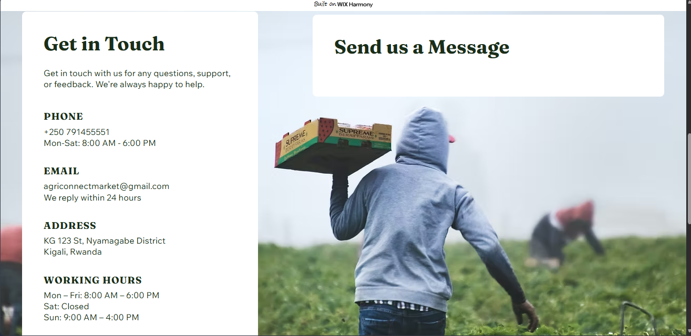

### 5. Cart Interaction & Checkout Simulation
*Shopping cart overlay, main cart page, and simulated checkout flow.*
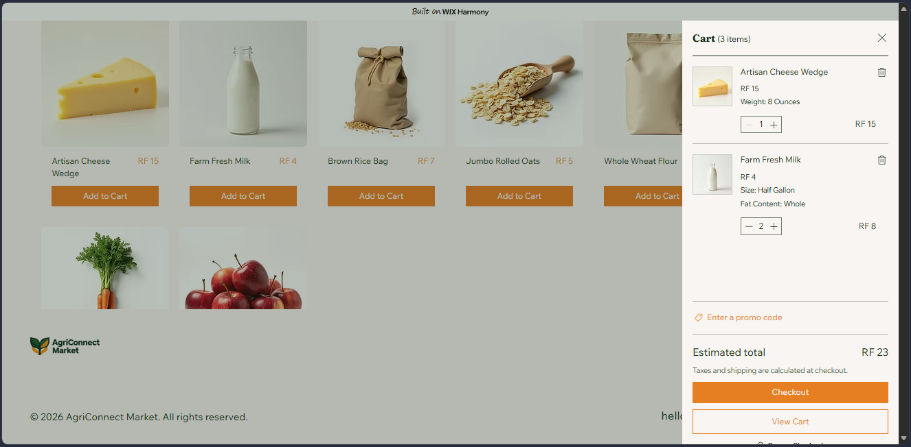
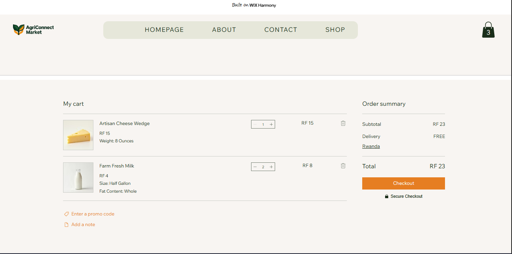
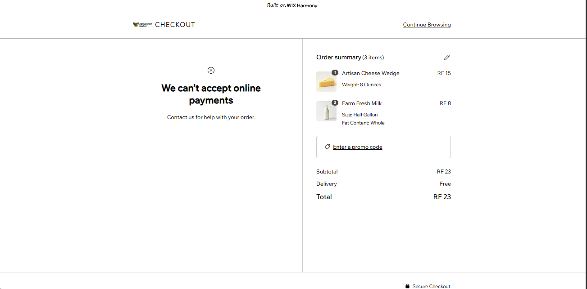

---

## 🛠️ Challenges
1. **Free Tier Checkout Limitations:** Since the e-commerce project is built on the free tier of Wix, actual merchant payment gateways cannot be integrated. To work around this, checkout is simulated, resulting in a system notice ("We can't accept online payments"), which serves as the final step of the cart interaction flow.
2. **Asset Sourcing & Consistency:** Selecting product images with uniform, high-quality, transparent backgrounds that matched the aesthetic of a premium grocery marketplace.
3. **Localization in Wix:** Configuring currency settings and custom units (like ounces, gallons, kilograms) to align with standard Rwandan grocery measurements (RWF/RF).

---

## 📚 Lessons Learned
1. **Low-Code Customization & Layouts:** Learned how to adjust Wix design systems, layout sections, and margins without writing raw CSS/HTML code.
2. **E-Commerce Architecture:** Gained hands-on experience structuring product databases, categorization, display pricing, cart additions, and checkout flow simulation.
3. **Responsive Web Design:** Learned how responsive layouts dynamically adapt to screen size changes.

---

## 🔗 Project Links
* **Live Website Link:** [AgroConnect Market on Wix](https://emmafrieda33.wixsite.com/agriconnect-market)
* **GitHub Repository Link:** [Agroconnect-Markets Repository](https://github.com/JemmaFrieda/Agroconnect-Markets)
